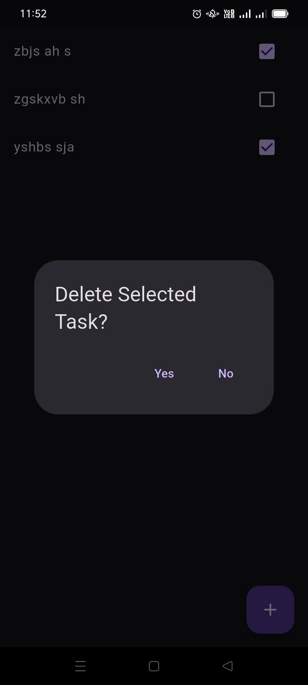
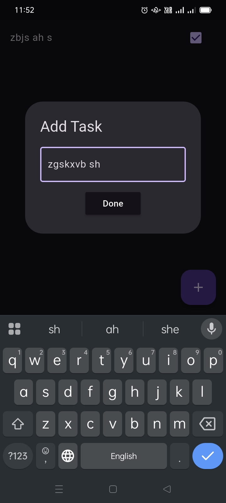

# 📝 Flutter ToDo App (MVVM + Sqflite)

## 📸 Screenshots

| Task Creation                   | Task List                       | Delete Confirmation             |
| ------------------------------- | ------------------------------- | ------------------------------- |
|  |  |  |

## 🚀 Overview

This is a beautiful and efficient **ToDo List App** built with **Flutter**, using the power of the **MVVM architecture** and **Sqflite** for local data persistence. It allows users to perform full **CRUD** operations — all offline and super smooth.

✅ Add tasks  
✅ Update task status  
✅ Delete tasks  
✅ View saved tasks persistently across app restarts
